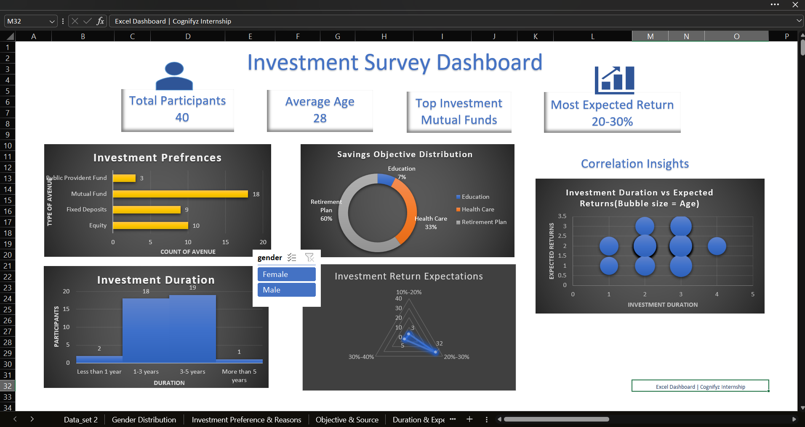

# Investment Survey Analysis Dashboard (Microsoft Excel)

## Overview

This project was completed as part of my Data Visualization Internship at Cognifyz Technologies. It focuses on analyzing investment survey data and presenting key insights through interactive visualizations and an Excel dashboard.

## Objectives

- Clean and prepare survey data
- Analyze investment behavior
- Perform correlation analysis
- Build an interactive dashboard

## Tools Used

- Microsoft Excel
- Pivot Tables
- Pivot Charts
- Slicers
- KPI Cards
- Data Visualization
- Correlation Analysis

## Visualizations

- Bar Chart
- Doughnut Chart
- Histogram
- Radar Chart
- Scatter Plot
- Bubble Chart

## Dashboard Features

- KPI Cards
- Interactive Gender Slicer
- Investment Preference Analysis
- Savings Objective Analysis
- Investment Duration Distribution
- Correlation Analysis

## Key Insights

- Mutual Funds were the most preferred investment avenue.
- Most participants expected 20–30% returns.
- Long-term investment duration was commonly preferred.
- Correlation analysis showed relationships between investment duration and expected returns.

## Repository Contents

- Excel Workbook
- Dashboard Screenshot
- Dataset

## Dashboard Preview

## Author

**Keshav Girdhar**

## Connect with Me

- LinkedIn: www.linkedin.com/in/keshav-girdhar-54949134a
